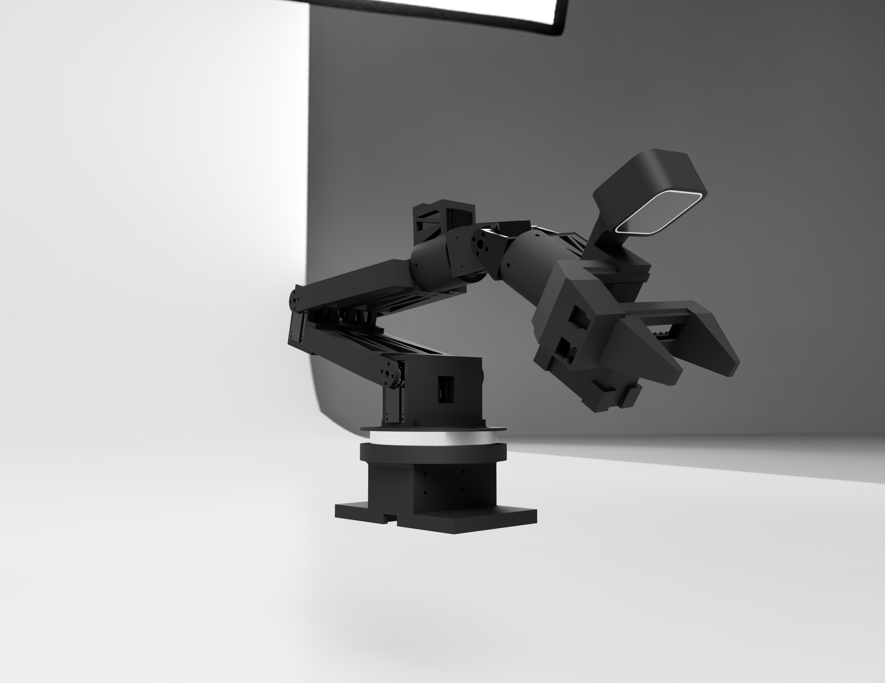

# ROS2 Framework for Constructor I

## Project Overview

This repository contains a complete ROS2-based framework for controlling the Constructor I custom robotic arm. The arm is designed for affordable, no-expert robotics with a focus on AI experimentation, such as visual SLAM, pose estimation, and grasping tasks. It integrates ros2_control for hardware interfacing, MoveIt for motion planning and execution, and is set up in an NVIDIA Isaac ROS Docker container for GPU-accelerated AI capabilities.

The codebase includes custom hardware drivers, control plugins, MoveIt configurations, and launch files. It supports both real hardware (Feetech STS3215 servos) and simulation modes, with RViz for visualization and interactive control.

### Key Features
- **Hardware Control**: Custom C++ driver and ros2_control plugin for servo communication and joint state publishing.
- **Motion Planning**: MoveIt with OMPL planner (robust for timestamps/velocities) and KDL kinematics.
- **Gripper Support**: Prismatic joint with gear-rack mechanism for opposite-moving clamps.
- **AI Readiness**: Built on Isaac ROS for integration with GEMs (e.g., usb_cam + visual_slam for pose, foundationpose for grasping).
- **Simulation/Testing**: Toggle real/sim with launch arg; manual torque mode for calibration.
- **Reliability**: Persistent Docker setup, Git backups, real-time kernel recommendations.

## Goals

### Main Goal
Create a stable, low-latency robotic arm system for AI-driven tasks, enabling sim-to-real transfer in robotics research. Focus on usability (RViz dragging for execution) and affordability.

### Sub-Goals
- Achieve end-to-end control: Planning, execution, and visualization in RViz/Foxglove.
- Fix MoveIt issues: Kinematics loading, interactive markers, trajectory validation (tolerances, timestamps).
- Ensure Docker persistence: Auto-restart on reboots, no auto-deletion.
- Backup codebase: GitHub syncing for recovery.
- Prepare for AI: Integrate cameras/SLAM for pose estimation, RL fine-tuning (e.g., grasping in Isaac Lab).

## System Requirements

- **Host OS**: Ubuntu 22.04 LTS (NVIDIA-compatible for Isaac ROS).
- **Hardware**: NVIDIA GPU (for Isaac GEMs); serial port (/dev/ttyUSB0) for arm servos.
- **ROS Version**: Humble (source /opt/ros/humble/setup.bash; container base may be Jazzy—manual fixes for compatibility).
- **Dependencies**: rclcpp, hardware_interface, pluginlib, controller_manager, moveit_ros_move_group, rviz2, foxglove_bridge, colcon, rosdep.
- **Container**: NVIDIA Isaac ROS Docker (built via run_dev.sh; mounts host workspace).
- **Arm Hardware**: Constructor I arm with 7 DOF (6 revolute + 1 prismatic gripper), Feetech STS3215 servos (1Mbps baud, IDs 1-13).

No real-time kernel by default (add for stability: `apt install linux-lowlatency-hwe-22.04`).

## Installation and Setup

### 1. Clone the Repository
git clone https://github.com/FLASH-73/ros2_framework.git
cd ros2_framework

### 2. Set Up Docker Container (Isaac ROS Based)
Use the modified `run_dev.sh` for persistent container:
- Navigate: `cd src/isaac_ros_common/scripts`
- Run: `./run_dev.sh`
- This builds/runs the container with --restart unless-stopped (auto-starts on reboot).

Inside container (/workspaces/isaac_ros-dev):
- Install deps: `rosdep install --from-paths src --ignore-src -r -y`
- Install extras (if needed): `apt install ros-humble-foxglove-bridge python3-colcon-common-extensions -y`

### 3. Build the Workspace

source /opt/ros/humble/setup.bash
colcon build --symlink-install
source install/setup.bash

### 4. (Optional) Real-Time Kernel
For low-latency: On host, `apt install linux-lowlatency-hwe-22.04`, reboot, select in GRUB.

## Usage

### Launch the Arm Control
- Real hardware: `ros2 launch simple_arm arm_control.launch.py use_real_hardware:=true`
- Simulation: `ros2 launch simple_arm arm_control.launch.py use_real_hardware:=false`

This starts:
- ros2_control (hardware plugin, controllers).
- MoveIt (planning with OMPL).
- RViz (for visualization/interaction).
- Foxglove Bridge (optional web viz).

### In RViz
- Motion Planning panel: Select group 'arm', start <current>, drag interactive marker (at gripper_ee).
- Plan & Execute small motions.
- Gripper: Use 'open'/'closed' states or position goals.

### Manual Mode/Calibration
- Torque off: Set `enable_torque_on_start:=false` in hardware params (launch arg or xacro).
- Hand-position arm, home via service (/home_arm).

### Testing
- Joint states: `ros2 topic echo /joint_states`
- Controllers: `ros2 control list_controllers` (all active).
- Debug: Check logs for kinematics/trajectory errors.

## Code Structure

- **src/simple_arm**: Hardware plugin/driver.
  - arm_hardware_interface.cpp/hpp: ros2_control SystemInterface for servos, conversions (rad/ticks, gripper dist).
  - sts_driver.cpp/hpp: Serial comm for STS servos (ping, read/write, sync_write).
  - launch/arm_control.launch.py: Main launch (URDF load, controllers, MoveIt, RViz, Foxglove).
- **src/mark_ii_moveit_new**: MoveIt configs.
  - config/MarkII_urdf.urdf.xacro: URDF with real/sim toggle.
  - config/MarkII_urdf.srdf: Groups (arm: 6 revolute, gripper: prismatic), states, EE, collisions.
  - config/kinematics.yaml: KDL for arm; none for gripper.
  - config/joint_limits.yaml: Vel/accel limits for time param.
  - config/controllers.yaml: Joint trajectory/gripper controllers.
  - config/ros2_controllers.yaml: Controller params.
- **Other**: isaac_ros_common (NVIDIA utils), ros2_control (forked for custom).
- Build Folders: build/install/log (excluded in .gitignore).

## Arm Mechanics and Operation

- **Joints**: 6 revolute (base continuous, unwrapped; others bounded ±π). Gripper prismatic (0-0.024m).
- **Servos**: Feetech STS3215 (SCS protocol). Dual-servos for joints 2/3 (mirroring opposite direction).
- **Gripper**: Gear to dual racks (opposite motion), clamps attached. Converts dist to ticks (clamped).
- **Calibration**: Per-joint scale/offset; base scaled x3.
- **Control Flow**: Driver → Hardware plugin (position commands/states) → Controllers → MoveIt planning (OMPL, time adapters) → Execution.
- **Behaviors**: RViz mirrors real states. Manual torque for sim accuracy testing. Offsets tolerated (0.05 rad).

## Troubleshooting

- **Launch Errors**: Install missing packages (e.g., foxglove_bridge via apt/rosdep).
- **MoveIt Issues**: Check SRDF/kinematics for chain mismatches; use OMPL.
- **Docker**: Use modified run_dev.sh for persistence; attach in VS Code.
- **Build Failures**: `rosdep install --from-paths src --ignore-src -r -y`; source ROS.
- **Segfault on Shutdown**: Known MoveIt bug; ignore or add RT kernel.

## License
MIT (see LICENSE). Contributions welcome—fork/PR.

## Credits
Based on ROS2 Humble, MoveIt, Isaac ROS. Thanks to Grok for troubleshooting guidance.

For questions, open an issue.
